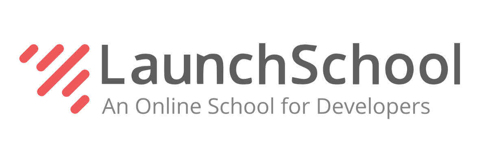

  

Frameworks

    - Ruby on Rails
     
    - Sinatra
     
    - React
     
    - React Native
     
    - Boot Strap
  

  

Languages

    - Javascript
     
    - HTML
     
    - CSS
     
    - Ruby
     
    - SQL
     
    - GraphQL
  

  

Database Management Systems

    - PostgreSQL
      
    - MySQL
     
    - SQLite
  

  

    
Other Proficient Software Systems

    - Adobe XD
     
    - AWS Services
     
    - CodePen
  

# Education
## Launch School - An Online School for Software Engineers

**Launch School** is an online school focused on the **mastery of foundational knowledge** of software engineering. This is largely accomplished through **rigorous assessments, quizzes and 1-on-1 interviews**. This is a multi-year program designed specifically for individuals seeking to launch a multi-decade career in software engineering.

# Current Projects
  ### Pull Up - An Event Finder for College Students
  #### Chief Technology Officer
   

     
Tech Stack

      - AWS Amplify
       
      - AWS Cloud9
       
      - AWS S3
       
      - AWS Mobile Hub
       
      - React Native
   

   ### Stockly -  Real-Time Stock Analysis Web Application
   

Tech Stack

    - Sinatra
     
    - FinnHub API
     
    - HTML
     
    - CSS
     
    - Embedded Ruby
   

